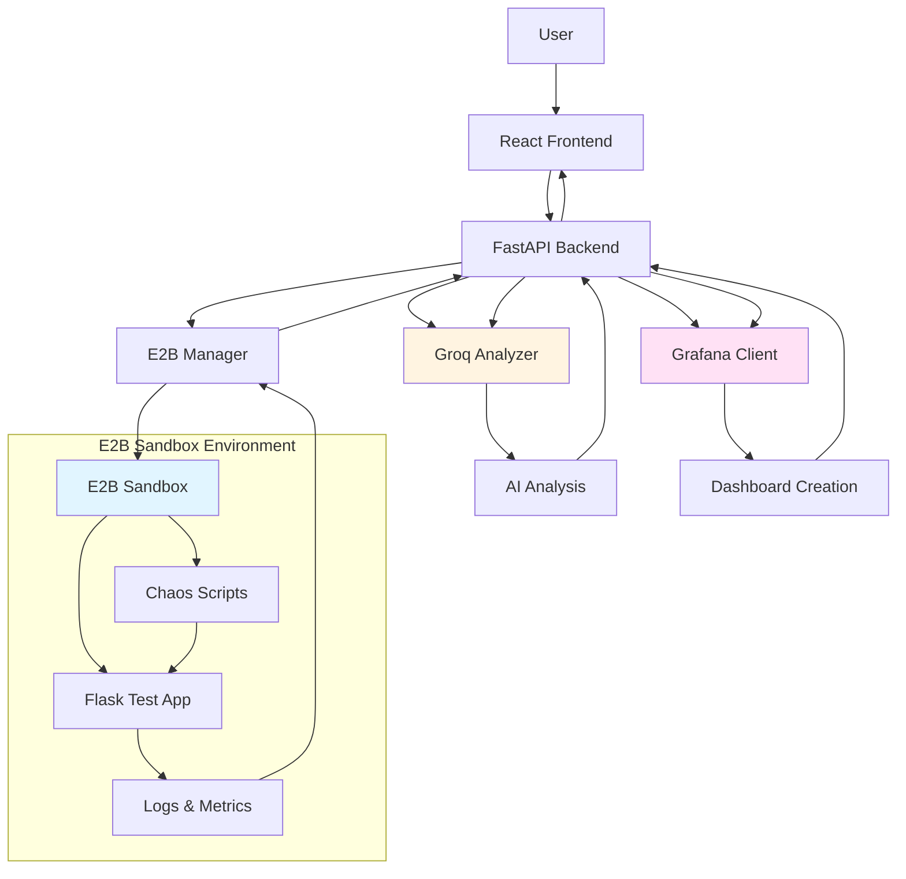

# ChaosLab Architecture

Detailed technical architecture documentation for the ChaosLab chaos engineering platform.

---

## System Overview

ChaosLab is a chaos engineering platform that enables developers to test application resilience through controlled failure injection in isolated environments. The system combines:

1. **E2B Cloud Sandboxes** - Isolated execution environments
2. **Groq AI** - Intelligent log analysis and insights
3. **Grafana MCP** - Metrics visualization
4. **FastAPI Backend** - Orchestration layer
5. **React Frontend** - User interface

---

## Architecture Diagram



---

## Component Details

### 1. Frontend (React + TypeScript)

**Location**: `/frontend`

**Responsibilities**:
- User interface for experiment configuration
- Real-time status updates via polling
- Results visualization
- Grafana dashboard embedding

**Key Components**:
- `ExperimentForm.tsx` - Scenario selection and configuration
- `ExperimentStatus.tsx` - Progress tracking with polling
- `ResultsView.tsx` - AI summary, metrics, and dashboard display
- `App.tsx` - State management and routing

**State Flow**:
```
form → running → results
  ↑                 ↓
  └─────────────────┘
```

**API Communication**:
- Uses Axios for HTTP requests
- Polls status endpoint every 2 seconds during execution
- Handles loading, error, and success states

---

### 2. Backend (FastAPI)

**Location**: `/backend`

**Responsibilities**:
- Experiment orchestration
- E2B sandbox lifecycle management
- Groq AI integration
- Grafana dashboard creation
- API endpoint exposure

**Key Files**:
- `main.py` - FastAPI application and endpoints
- `models.py` - Pydantic models for validation
- `services/e2b_manager.py` - Sandbox management
- `services/groq_analyzer.py` - AI analysis
- `services/grafana_client.py` - Dashboard creation

**Experiment Flow**:
```python
1. Receive experiment request
2. Create E2B sandbox
3. Deploy test application
4. Execute chaos script
5. Collect logs and metrics
6. Analyze with Groq AI
7. Create Grafana dashboard
8. Cleanup sandbox
9. Return results
```

**Data Storage**:
- In-memory dictionary for experiments (demo)
- Production should use PostgreSQL/Redis

---

### 3. E2B Manager

**Location**: `/backend/services/e2b_manager.py`

**Responsibilities**:
- Create and destroy sandboxes
- Deploy test applications
- Execute chaos scripts
- Collect system metrics and logs

**Sandbox Lifecycle**:
```
create() → deploy_test_app() → run_chaos_script() → collect_metrics() → cleanup()
```

**Chaos Scripts**:
Each scenario has a bash script that:
1. Injects specific failure condition
2. Runs for configured duration
3. Makes requests to test app
4. Cleans up after completion

**Metrics Collection**:
- CPU usage via `top` command
- Memory usage via `free` command
- Application logs from `/tmp/flask_app.log`
- Error count from log parsing

---

### 4. Groq Analyzer

**Location**: `/backend/services/groq_analyzer.py`

**Responsibilities**:
- Analyze experiment logs
- Extract structured metrics
- Generate human-readable summaries
- Provide recommendations

**AI Prompt Structure**:
```
System: You are a chaos engineering expert...
User: Analyze this experiment:
  - Scenario: network_delay
  - Metrics: CPU 85%, Memory 78%, 12 errors
  - Logs: [application logs]
  
Return JSON with:
  - summary
  - metrics
  - severity
  - recommendations
```

**Response Format**:
```json
{
  "summary": "App experienced 300ms latency...",
  "metrics": {
    "cpu_peak": 85.5,
    "memory_peak": 78.2,
    "error_count": 12,
    "recovery_time_seconds": 8.0
  },
  "severity": "medium",
  "recommendations": [
    "Implement exponential backoff",
    "Add circuit breaker pattern"
  ]
}
```

**Fallback Mechanism**:
If Groq API fails, uses rule-based analysis based on metric thresholds.

---

### 5. Grafana Client

**Location**: `/backend/services/grafana_client.py`

**Responsibilities**:
- Create dashboards programmatically
- Add metric panels
- Return shareable URLs

**Dashboard Structure**:
```json
{
  "dashboard": {
    "title": "ChaosLab - Network Delay - exp_abc123",
    "panels": [
      {"id": 1, "title": "CPU Usage", "type": "stat"},
      {"id": 2, "title": "Memory Usage", "type": "stat"},
      {"id": 3, "title": "Error Count", "type": "stat"},
      {"id": 4, "title": "Recovery Time", "type": "stat"}
    ]
  }
}
```

**Panel Configuration**:
- Stat panels with thresholds
- Color-coded based on severity
- Green (good) → Yellow (warning) → Red (critical)

**MCP Integration**:
- Uses Grafana HTTP API
- Bearer token authentication
- Creates dashboard in default organization

---

## Data Flow

### Experiment Execution Flow

```
1. User submits experiment request
   ↓
2. Backend creates experiment record
   status: PENDING, progress: 0%
   ↓
3. Create E2B sandbox
   status: RUNNING, progress: 30%
   ↓
4. Deploy Flask test app
   progress: 50%
   ↓
5. Execute chaos script
   progress: 70%
   ↓
6. Collect logs and metrics
   status: ANALYZING, progress: 85%
   ↓
7. Groq analyzes results
   progress: 90%
   ↓
8. Create Grafana dashboard
   progress: 95%
   ↓
9. Cleanup sandbox
   status: COMPLETED, progress: 100%
   ↓
10. Return results to frontend
```

### Status Polling Flow

```
Frontend (every 2s)
   ↓
GET /api/experiment/{id}/status
   ↓
Backend returns current status
   ↓
Frontend updates UI
   ↓
If status === 'completed'
   ↓
Fetch results
```

---

## Security Considerations

### Sandbox Isolation
- E2B provides process-level isolation
- No network access to host machine
- Automatic cleanup prevents resource leaks

### API Security
- CORS configured for frontend origin
- Environment variables for secrets
- No hardcoded credentials

### Input Validation
- Pydantic models validate all inputs
- Duration limited to 10-300 seconds
- Scenario restricted to enum values

---

## Scalability Considerations

### Current Limitations (Demo)
- In-memory storage (lost on restart)
- Synchronous experiment execution
- Single backend instance

### Production Improvements
1. **Database**: PostgreSQL for persistence
2. **Queue**: Celery/RQ for async execution
3. **Caching**: Redis for status updates
4. **Load Balancer**: Multiple backend instances
5. **Monitoring**: Prometheus + Grafana for platform metrics

---

## Error Handling

### Backend Errors
- Try-catch blocks around all external calls
- Graceful degradation (fallback analysis)
- Automatic sandbox cleanup on failure
- Detailed error messages in responses

### Frontend Errors
- Error boundaries for component crashes
- User-friendly error messages
- Retry mechanisms for transient failures
- Loading states for async operations

---

## Testing Strategy

### Backend Tests
```bash
pytest backend/tests/
```

Test coverage:
- Unit tests for each service
- Integration tests for API endpoints
- Mock E2B/Groq for faster tests

### Frontend Tests
```bash
npm test
```

Test coverage:
- Component rendering tests
- User interaction tests
- API client mocking

### E2E Tests
- Cypress for full workflow testing
- Test each chaos scenario
- Verify dashboard creation

---

## Performance Metrics

### Expected Timings
- Sandbox creation: 10-20s
- Test app deployment: 5-10s
- Chaos execution: 10-300s (configurable)
- Groq analysis: 2-5s
- Dashboard creation: 1-3s
- Total: ~30-350s depending on duration

### Optimization Opportunities
1. **Parallel operations**: Deploy app while sandbox initializes
2. **Caching**: Reuse sandboxes for multiple experiments
3. **Streaming**: Stream logs in real-time instead of batch
4. **Pre-warming**: Keep sandboxes ready in pool

---

## Deployment

### Development
```bash
# Backend
cd backend && python main.py

# Frontend
cd frontend && npm run dev
```

### Production
```bash
# Backend
uvicorn main:app --host 0.0.0.0 --port 8000 --workers 4

# Frontend
npm run build
# Serve dist/ with nginx or similar
```

### Docker (Future)
```dockerfile
# Backend Dockerfile
FROM python:3.10
COPY backend/ /app
RUN pip install -r requirements.txt
CMD ["uvicorn", "main:app", "--host", "0.0.0.0"]

# Frontend Dockerfile
FROM node:18 AS build
COPY frontend/ /app
RUN npm install && npm run build

FROM nginx:alpine
COPY --from=build /app/dist /usr/share/nginx/html
```

---

## Future Enhancements

### Phase 2 Features
1. **Custom Docker images**: Let users test their own apps
2. **Historical trends**: Track resilience over time
3. **Scheduled experiments**: Run chaos tests nightly
4. **Slack/Discord alerts**: Notify on failures
5. **Multi-region**: Test across different E2B regions
6. **Comparison mode**: Compare before/after improvements

### Advanced Scenarios
1. **Network partition**: Simulate split-brain scenarios
2. **Clock skew**: Test time-dependent logic
3. **Resource contention**: Multiple processes competing
4. **Cascading failures**: Chain multiple failures

---

## Monitoring & Observability

### Application Metrics
- Experiment success/failure rate
- Average execution time
- Groq API latency
- E2B sandbox creation time

### Business Metrics
- Experiments per day
- Most popular scenarios
- User retention
- Dashboard views

### Logging
- Structured JSON logs
- Log levels: DEBUG, INFO, WARNING, ERROR
- Correlation IDs for tracing

---

## Conclusion

ChaosLab provides a complete chaos engineering platform with:
- ✅ Isolated execution (E2B)
- ✅ AI-powered insights (Groq)
- ✅ Beautiful visualizations (Grafana)
- ✅ Modern tech stack (FastAPI + React)
- ✅ Developer-friendly UX

Perfect for hackathons, demos, and learning chaos engineering principles!
